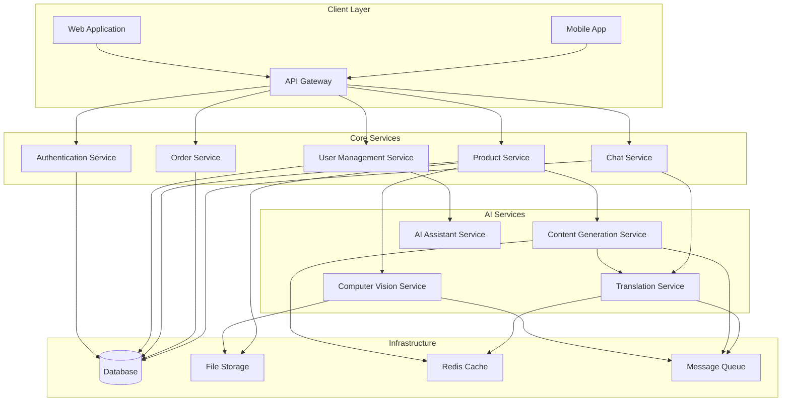

# Design Document: AI-Powered Digital Marketplace for Local Artisans

## Overview

The AI-powered digital marketplace for local artisans is designed as a microservices-based platform that leverages computer vision, natural language processing, and multilingual AI to democratize e-commerce for economically disadvantaged craftspeople. The system transforms simple product images into professional marketplace listings while providing comprehensive business support through AI assistance.

The platform addresses three core challenges: digital literacy barriers, language accessibility, and marketing expertise gaps. By using image-first onboarding and AI-generated content, artisans can create professional listings without technical skills, while multilingual support ensures language is never a barrier to commerce.

## Architecture

The system follows a microservices architecture pattern optimized for AI workloads, with clear separation between content generation, translation services, and marketplace functionality. This approach enables independent scaling of AI-intensive operations while maintaining system reliability.



## Components and Interfaces

### Computer Vision Service

The Computer Vision Service analyzes uploaded product images to extract visual characteristics, materials, craftsmanship details, and cultural elements. It uses advanced image recognition models to identify product categories, colors, textures, and artistic techniques.

**Key Functions:**
- Image preprocessing and quality enhancement
- Object detection and classification
- Material and texture analysis
- Cultural pattern recognition
- Quality assessment and recommendations

**Interface:**
```
POST /vision/analyze
{
  "image_url": "string",
  "artisan_context": {
    "region": "string",
    "craft_type": "string"
  }
}

Response:
{
  "analysis": {
    "category": "string",
    "materials": ["string"],
    "colors": ["string"],
    "techniques": ["string"],
    "cultural_elements": ["string"],
    "quality_score": "number"
  }
}
```

### Content Generation Service

The Content Generation Service creates professional product listings based on visual analysis and optional artisan input. It generates SEO-optimized titles, engaging descriptions, relevant tags, and marketing copy while maintaining cultural authenticity and respect.

**Key Functions:**
- Title generation with SEO optimization
- Short and long description creation
- Tag and category suggestion
- Price recommendation based on market analysis
- Marketing asset generation (social media content, promotional materials)

**Interface:**
```
POST /content/generate
{
  "vision_analysis": "object",
  "artisan_input": "string",
  "target_language": "string",
  "content_type": "listing|marketing|social"
}

Response:
{
  "content": {
    "title": "string",
    "short_description": "string",
    "long_description": "string",
    "tags": ["string"],
    "suggested_price": "number",
    "marketing_assets": ["object"]
  }
}
```

### Translation Service

The Translation Service provides real-time multilingual support for all platform interactions, including content generation, user interfaces, and chat communications. It uses transformer-based neural machine translation optimized for cultural context and craft-specific terminology.

**Key Functions:**
- Real-time text translation
- Speech-to-text conversion
- Cultural context preservation
- Craft-specific terminology handling
- Quality assessment and confidence scoring

**Interface:**
```
POST /translate/text
{
  "text": "string",
  "source_language": "string",
  "target_language": "string",
  "context": "craft|chat|listing|ui"
}

Response:
{
  "translated_text": "string",
  "confidence_score": "number",
  "cultural_adaptations": ["string"]
}
```

### AI Assistant Service

The AI Assistant Service provides personalized business guidance, product development suggestions, and marketing strategies tailored to each artisan's skills, location, and market opportunities. It maintains conversation context and learning from artisan interactions.

**Key Functions:**
- Product idea generation
- Business strategy recommendations
- Market trend analysis
- Seasonal opportunity identification
- Skill development guidance

**Interface:**
```
POST /assistant/chat
{
  "artisan_id": "string",
  "message": "string",
  "context": "product_ideas|marketing|business_advice"
}

Response:
{
  "response": "string",
  "suggestions": ["string"],
  "resources": ["object"],
  "follow_up_questions": ["string"]
}
```

### Product Service

The Product Service manages the complete product lifecycle from creation to marketplace display. It orchestrates AI services for content generation and maintains product data integrity while supporting search and discovery features.

**Key Functions:**
- Product creation and management
- Search and filtering
- Category management
- Inventory tracking
- Performance analytics

### User Management Service

The User Management Service handles authentication, profile management, and role-based access control for artisans, buyers, and NGO administrators. It maintains user preferences, language settings, and activity history.

### Chat Service

The Chat Service enables real-time communication between buyers and artisans with automatic translation support. It maintains conversation history and provides moderation capabilities.

## Data Models

### Artisan Profile
```
{
  "artisan_id": "uuid",
  "personal_info": {
    "name": "string",
    "location": {
      "region": "string",
      "country": "string",
      "coordinates": "object"
    },
    "languages": ["string"],
    "preferred_language": "string"
  },
  "craft_info": {
    "specialties": ["string"],
    "techniques": ["string"],
    "experience_years": "number",
    "cultural_background": "string"
  },
  "business_info": {
    "registration_status": "string",
    "ngo_sponsor": "string",
    "verification_level": "string"
  },
  "preferences": {
    "content_generation_style": "string",
    "marketing_preferences": "object",
    "notification_settings": "object"
  }
}
```

### Product Listing
```
{
  "product_id": "uuid",
  "artisan_id": "uuid",
  "content": {
    "title": "string",
    "short_description": "string",
    "long_description": "string",
    "tags": ["string"],
    "category": "string",
    "subcategory": "string"
  },
  "visual_data": {
    "primary_image": "string",
    "additional_images": ["string"],
    "vision_analysis": "object"
  },
  "pricing": {
    "base_price": "number",
    "currency": "string",
    "suggested_price_range": "object"
  },
  "metadata": {
    "materials": ["string"],
    "techniques": ["string"],
    "cultural_significance": "string",
    "creation_time_estimate": "string"
  },
  "multilingual_content": {
    "translations": "object",
    "original_language": "string"
  },
  "status": {
    "availability": "string",
    "moderation_status": "string",
    "visibility": "string"
  }
}
```

### AI Analysis Result
```
{
  "analysis_id": "uuid",
  "product_id": "uuid",
  "vision_analysis": {
    "detected_objects": ["object"],
    "materials": ["string"],
    "colors": ["string"],
    "techniques": ["string"],
    "quality_indicators": "object",
    "cultural_elements": ["string"]
  },
  "content_generation": {
    "generated_titles": ["string"],
    "descriptions": "object",
    "suggested_tags": ["string"],
    "seo_keywords": ["string"]
  },
  "market_analysis": {
    "category_trends": "object",
    "price_recommendations": "object",
    "competition_analysis": "object"
  },
  "confidence_scores": {
    "vision_accuracy": "number",
    "content_quality": "number",
    "market_relevance": "number"
  }
}
```

### NGO Organization
```
{
  "ngo_id": "uuid",
  "organization_info": {
    "name": "string",
    "registration_number": "string",
    "contact_details": "object",
    "service_areas": ["string"]
  },
  "capabilities": {
    "supported_crafts": ["string"],
    "languages": ["string"],
    "training_programs": ["object"]
  },
  "artisan_management": {
    "onboarded_artisans": ["uuid"],
    "success_metrics": "object",
    "support_activities": ["object"]
  }
}
```

Now I need to use the prework tool to analyze the acceptance criteria before writing the Correctness Properties section:

<function_calls>
<invoke name="prework">
<parameter name="featureName">artisan-marketplace

## Correctness Properties

*A property is a characteristic or behavior that should hold true across all valid executions of a system—essentially, a formal statement about what the system should do. Properties serve as the bridge between human-readable specifications and machine-verifiable correctness guarantees.*

Based on the prework analysis and property reflection, the following properties validate the core functionality of the artisan marketplace:

### Property 1: Image Analysis Completeness
*For any* uploaded product image, the Computer Vision Service should extract structured analysis data containing materials, colors, techniques, and category information with non-empty values for each field.
**Validates: Requirements 1.1**

### Property 2: Content Generation Consistency  
*For any* image analysis result, the Content Generator should produce a complete content package including a professional title, short description (50-100 words), long description (200-300 words), relevant tags, and price recommendation.
**Validates: Requirements 1.2, 1.3, 1.4, 1.6**

### Property 3: User Input Integration
*For any* content generation request with optional artisan input, the generated descriptions should incorporate or reference the provided text while maintaining professional quality.
**Validates: Requirements 1.5**

### Property 4: Multilingual Translation Consistency
*For any* text content and supported language pair, the Translation Service should produce translations that preserve meaning and maintain consistent terminology across all platform contexts (UI, listings, chat).
**Validates: Requirements 2.1, 2.3, 2.4, 2.5**

### Property 5: Speech-to-Text Accuracy
*For any* voice input in a supported language, the Translation Service should convert speech to text with the output language matching the selected input language.
**Validates: Requirements 2.2**

### Property 6: SEO Content Optimization
*For any* generated product content, titles and descriptions should contain relevant keywords and follow SEO best practices while including material details, techniques, and cultural significance.
**Validates: Requirements 3.1, 3.2**

### Property 7: Marketing Asset Generation
*For any* product listing, the AI Agent should generate platform-specific marketing assets (social media images, video scripts, formatted content) suitable for Instagram, WhatsApp, and Facebook.
**Validates: Requirements 3.3, 3.4, 9.1, 9.2, 9.3, 9.4**

### Property 8: Marketplace Display Completeness
*For any* product listing displayed in the marketplace, it should contain all required fields (image, title, price) and be properly formatted for the target platform.
**Validates: Requirements 4.1**

### Property 9: Search Result Relevance
*For any* search query with keywords, categories, or filters, returned results should match the specified criteria and be properly ranked by relevance.
**Validates: Requirements 4.2**

### Property 10: User Interaction Persistence
*For any* user action (like, follow, chat initiation), the system should persist the action, update relevant data structures, and trigger appropriate notifications.
**Validates: Requirements 4.3, 4.4, 4.5**

### Property 11: Payment Processing Availability
*For any* purchase request, the system should provide secure payment processing options and handle transactions according to security standards.
**Validates: Requirements 4.6**

### Property 12: AI Assistant Response Generation
*For any* artisan request for business assistance (product ideas, marketing advice, business guidance), the AI Agent should provide relevant, actionable recommendations based on the artisan's profile and market context.
**Validates: Requirements 5.1, 5.2, 5.3, 5.4**

### Property 13: Opportunity Notification Delivery
*For any* seasonal opportunity, training program, or relevant event, the system should notify eligible artisans based on their profile, location, and interests.
**Validates: Requirements 5.5, 6.4**

### Property 14: NGO Administrative Access
*For any* registered NGO, the platform should provide administrative tools for bulk artisan onboarding, progress tracking, and access to relevant government schemes and programs.
**Validates: Requirements 6.1, 6.2, 6.3, 6.5**

### Property 15: Authentication Security Enforcement
*For any* user registration or login attempt, the system should enforce security requirements (email verification, password policies, secure sessions) and handle authentication according to security standards.
**Validates: Requirements 7.1, 7.2**

### Property 16: Data Protection Compliance
*For any* sensitive user data (personal information, payment details), the system should encrypt the data in storage and provide secure deletion options while maintaining necessary transaction records.
**Validates: Requirements 7.3, 7.5**

### Property 17: Security Monitoring Response
*For any* detected suspicious activity, the system should implement appropriate security measures and notify affected users according to the threat level.
**Validates: Requirements 7.4**

### Property 18: Content Moderation Enforcement
*For any* new or updated listing content, the system should validate it against platform guidelines, flag inappropriate content, and provide compliance guidance when violations are detected.
**Validates: Requirements 8.1, 8.2, 8.3, 8.5**

### Property 19: Dispute Resolution Availability
*For any* reported dispute, the system should provide resolution mechanisms and maintain complete audit trails of all actions and communications.
**Validates: Requirements 8.4**

### Property 20: Social Media Analytics Tracking
*For any* shared content on social platforms, the system should track engagement metrics and provide analytics on social media performance.
**Validates: Requirements 9.5**

### Property 21: Mobile Responsiveness
*For any* mobile device with varying screen sizes, the platform should provide responsive design that adapts interface elements appropriately.
**Validates: Requirements 10.1**

### Property 22: Offline Functionality
*For any* basic operation (viewing saved content, accessing cached data), the system should function with limited or no internet connectivity.
**Validates: Requirements 10.2**

### Property 23: Image Optimization
*For any* uploaded image, the system should automatically optimize file size and format to reduce data usage while maintaining visual quality.
**Validates: Requirements 10.4**

### Property 24: Voice Interface Feedback
*For any* voice input interaction, the system should provide clear audio feedback and confirmation to guide users through the process.
**Validates: Requirements 10.5**

## Error Handling

The system implements comprehensive error handling across all services with graceful degradation and user-friendly error messages:

### AI Service Error Handling
- **Vision Analysis Failures**: When image analysis fails, provide manual input options and suggest image quality improvements
- **Content Generation Errors**: Fall back to template-based content generation with manual editing capabilities
- **Translation Service Outages**: Cache common translations and provide offline language support for critical functions

### Infrastructure Error Handling
- **Database Connection Issues**: Implement connection pooling, retry logic, and read replicas for high availability
- **File Storage Failures**: Use redundant storage with automatic failover and backup retrieval
- **Network Connectivity Problems**: Implement offline-first design with data synchronization when connectivity returns

### User Experience Error Handling
- **Invalid Input Handling**: Provide clear validation messages and suggestions for correction
- **Authentication Failures**: Implement secure account recovery and multi-factor authentication options
- **Payment Processing Errors**: Provide alternative payment methods and clear error explanations

### Monitoring and Alerting
- **Real-time Error Tracking**: Monitor error rates, response times, and user experience metrics
- **Automated Recovery**: Implement circuit breakers and automatic service recovery mechanisms
- **User Communication**: Provide status pages and proactive communication during service disruptions

## Testing Strategy

The testing strategy employs a dual approach combining property-based testing for universal correctness validation with targeted unit testing for specific scenarios and edge cases.

### Property-Based Testing
Property-based tests validate the universal properties defined above using randomized inputs to ensure system correctness across all possible scenarios. Each property test will:
- Run a minimum of 100 iterations with randomized inputs
- Generate diverse test data including edge cases and boundary conditions
- Validate that properties hold true regardless of input variations
- Use appropriate property-based testing libraries (QuickCheck for Haskell, Hypothesis for Python, fast-check for JavaScript)

**Property Test Configuration:**
- **Minimum iterations**: 100 per property test
- **Test data generation**: Custom generators for artisan profiles, product images, multilingual content
- **Failure analysis**: Automatic shrinking to find minimal failing examples
- **Test tagging**: Each test tagged with format: **Feature: artisan-marketplace, Property {number}: {property_text}**

### Unit Testing Strategy
Unit tests complement property-based tests by focusing on:
- **Specific Examples**: Test known good and bad inputs with expected outputs
- **Edge Cases**: Test boundary conditions, empty inputs, malformed data
- **Integration Points**: Test service interactions and API contracts
- **Error Conditions**: Test error handling and recovery mechanisms

**Unit Test Coverage:**
- **AI Service Integration**: Test API contracts and response formats
- **Database Operations**: Test CRUD operations and data integrity
- **Authentication Flows**: Test login, registration, and session management
- **Payment Processing**: Test transaction flows and security measures

### Integration Testing
- **End-to-End Workflows**: Test complete user journeys from image upload to product sale
- **Cross-Service Communication**: Test service interactions and data flow
- **Performance Testing**: Test system performance under load and stress conditions
- **Security Testing**: Test authentication, authorization, and data protection

### Testing Infrastructure
- **Automated Test Execution**: Continuous integration with automated test runs
- **Test Environment Management**: Separate environments for development, staging, and production testing
- **Test Data Management**: Automated test data generation and cleanup
- **Performance Monitoring**: Track test execution times and system performance metrics

The combination of property-based and unit testing ensures comprehensive coverage while maintaining development velocity and system reliability.